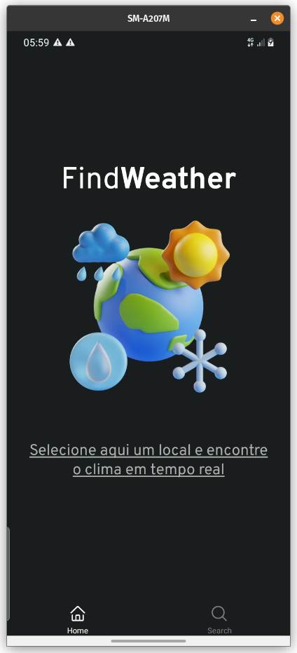

    <h1>Find<strong>Weather</strong></h1>
    

## Resumo
- [Resumo](#resumo)
- [⛈️ Sobre o projeto](#️-sobre-o-projeto)
- [🔧 Tecnologias](#-tecnologias)
- [📷 Imagens](#-imagens)

## ⛈️ Sobre o projeto

O Find**Weather** é um app para ajudar na busca de uma cidade e saber o clima atual e dos próximos dias em tempo real.

## 🔧 Tecnologias

- React Native
- Native Stitches
- Intl
- Expo
- Fastlane
- Open Weather Map API
- Weather API
- Opencage API

## 📷 Imagens

    
    
    
    
    
    

